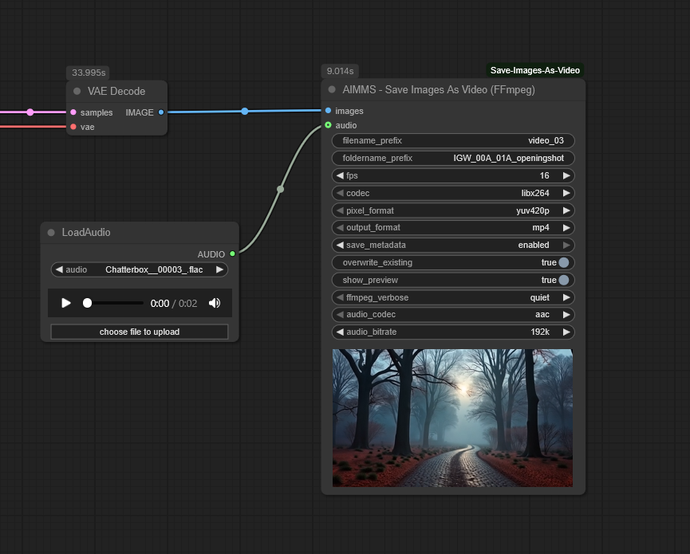

# Save Images to Video (FFmpeg) for ComfyUI - Forked Version

> ⚠️ This is the `dev` branch — a work-in-progress. Things may be broken or incomplete. For stable code, see the `main` branch.

---

## 🔄 Fork Notice

This project is a **fork of [ComfyUI-Save-Images-as-Video](https://github.com/San4itos/ComfyUI-Save-Images-as-Video)** by [@San4itos](https://github.com/San4itos).

Credit and thanks to the original author. This fork is being heavily adapted for a different use case and is **not intended as a drop-in replacement** or a contribution back to the original. Changes may include language updates, functionality shifts, and integration with other tools.

Please refer to the original repo if you're looking for a more stable or unmodified version.

## License
This project remains under the [GNU GPL v3](./LICENSE) as required by the original license.

---

A custom node for ComfyUI to save image sequences as video files using FFmpeg. Supports various codecs, audio muxing, and in-node previews.



## Features

*   Saves image frames to MP4, WebM, MOV, AVI, MKV.
*   Video Codecs: libx264, libx265, mpeg4, libvpx-vp9, libsvtav1.
*   Configurable FPS, pixel format.
*   Optional audio input with configurable codec (AAC, MP3, libopus, copy) and bitrate.
*   In-node preview (H.265 in-node preview is broken).
*   *(New)* More control over filename and foldername output
*   *(New)* png metadata save option.

## Installation

Check which type you have, look for:

- 1. Python installed in the system path (standard installation)
- 2. A `python_embeded` folder in your ComfyUI root directory (embedded Python portable version)


### 1.  **For ComfyUI with standard installation:**
    ```bash
    cd ComfyUI/custom_nodes/
    git clone https://github.com/mdkberry/ComfyUI-Save-Images-As-Video.git 
    cd ComfyUI-Save-Images-As-Video
    pip install -r requirements.txt
    ```

### 2. **For Comfyui portable installation**:
- **Navigate to ComfyUI root directory (not custom_nodes)**
    - `cd path/to/ComfyUI_windows_portable/ComfyUI`

- **Clone the repository**:
    - `cd custom_nodes/`
    - `git clone https://github.com/mdkberry/ComfyUI-Save-Images-As-Video.git`
    - `cd ../..` *(to get back to `/ComfyUI_windows_portable` directory)*

- **Install requirements using embedded Python**:
    - *you should be in `/ComfyUI_windows_portable` directory to run the following command:*
    - `python_embeded\python.exe -m pip install -r custom_nodes\ComfyUI-Save-Images-As-Video\requirements.txt`

---

### 3.  **FFmpeg:**
    *   **Option 1 (Portable):** Place `ffmpeg` executable into `ComfyUI-Save-Images-as-Video/ffmpeg_bin/`.
    *   **Option 2 (Custom Path):** Edit `ffmpeg_config.ini` in the node's folder to point to your FFmpeg folder.
    *   **Option 3 (System PATH):** If FFmpeg is in your system PATH, it will be used if options 1 or 2 are not set/found.

Find the node in "Add Node" -> "mdkberry" -> "Save Images As Video (FFmpeg)".

## Usage
Connect `IMAGE` output to `images` input. Configure parameters as needed. Optionally connect `AUDIO` input.

**H.265 Preview Note:** In-node H.265 previews might not work. The video file is saved correctly, and live preview in the ComfyUI queue section works.

## Filename and Folder Naming
The `SaveFramesToVideoFFmpeg` node allows you to specify custom filenames and folder structures for saving video output and metadata.

- **filename_prefix**: Defines the base name of the output video file (without the file extension, which is determined by `output_format`). For example, if `filename_prefix` is `my_video` and `output_format` is `mp4`, the output file will be `my_video.mp4`. If a file with the same name exists, a three-digit counter (e.g., `_001`) is appended to create a unique filename (e.g., `my_video_001.mp4`).

- **foldername_prefix**: Specifies a custom subfolder within the output directory where the video and metadata PNG (if enabled) are saved. The node creates this subfolder if it doesn't exist. For example, if `foldername_prefix` is `my_videos`, files are saved in `output_directory/my_videos/`.

*These parameters allow precise control over the output file's name and location, supporting clean and organized file management without automatic counter suffixes.*

#### Overwrite Protection
The node prevents overwriting existing files by appending a three-digit counter (e.g., `_001`) to the video and PNG filenames if files with the same names exist in the output directory. This ensures unique filenames for each run, preserving previous outputs. *(Note: unlike with other video saving nodes this suffix is only added if there is an existing filename, otherwise it will not add a suffix)*

## Metadata Saving

The node can save workflow metadata in a PNG file of the first video frame, allowing the workflow to be loaded back into ComfyUI. Set `save_metadata` to `"enabled"` (default) to save a PNG file named `<filename_prefix>.png` (or `<filename_prefix>_001.png` if needed to avoid overwriting) in the output directory. This PNG contains the workflow's `prompt` and `extra_pnginfo` data embedded as metadata, compatible with ComfyUI's workflow loading. If `save_metadata` is `"disabled"`, no PNG file is saved.

